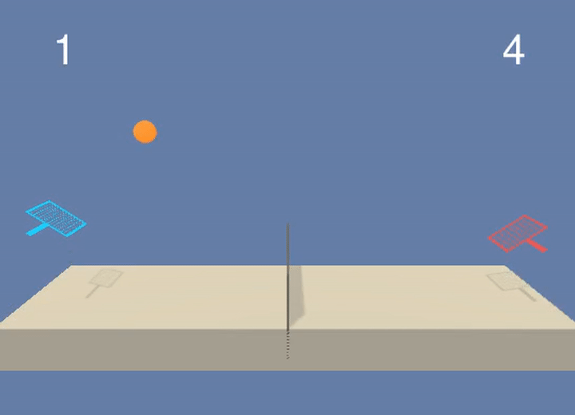

## Multiagent Reinforcement Learning - MADDPG applied to Tennis



This repository holds the project code for using Deep Reinforcement Learning - MADDPG on Tennis envrionment with continuous controls provided by Unity Technology. It is part of the Udacity [Deep Reinforcement Learning Nanodegree](https://www.udacity.com/course/deep-reinforcement-learning-nanodegree--nd893) requirement. 

The state is represented as a 24 dimensional observations including the ball and agent's position, speed etc. collected from three consecutive time frames. The action space is a dimension of 2. The two agents control rackets to bounce a ball across the net and keep it within the court without falling as long as possible - each time a ball is bounced back within the court the agent receives a reward of +0.1 or lose 0.01 if the ball falls. The environment is considered solved when one agent receives a cumulative return of +0.5 or above, averaged over 100 episodes.

## Installation
To set up your python environment to run the code in this repository, follow the instructions below.

1. Create (and activate) a new environment with Python 3.6.

	- __Linux__ or __Mac__: 
	```bash
	conda create --name drlnd python=3.6
	source activate drlnd
	```
	- __Windows__: 
	```bash
	conda create --name drlnd python=3.6 
	activate drlnd
	```
2. Clone the repository (if you haven't already!), and navigate to the `python/` folder.  Then, install several dependencies.
```bash
git clone https://github.com/udacity/deep-reinforcement-learning.git
cd deep-reinforcement-learning/python
pip install .
```

3. Create an [IPython kernel](http://ipython.readthedocs.io/en/stable/install/kernel_install.html) for the `drlnd` environment.  
```bash
python -m ipykernel install --user --name drlnd --display-name "drlnd"
```

4. Before running code in a notebook, change the kernel to match the `drlnd` environment by using the drop-down `Kernel` menu. 

5. Download the environment - there are two versions of the environment below (specifically built for this project, **not** the Unity ML-Agents package). Then place the file in the root folder and unzip the file.
    * Linux: [click here](https://s3-us-west-1.amazonaws.com/udacity-drlnd/P3/Tennis/Tennis_Linux.zip)
    * Mac: [click here](https://s3-us-west-1.amazonaws.com/udacity-drlnd/P3/Tennis/Tennis.app.zip)
    * Windows (32-bit): [click here](https://s3-us-west-1.amazonaws.com/udacity-drlnd/P3/Tennis/Tennis_Windows_x86.zip)
    * Windows (64-bit): [click here](https://s3-us-west-1.amazonaws.com/udacity-drlnd/P3/Tennis/Tennis_Windows_x86_64.zip)

6. Import the environment in Jupyter notebook under the the *drlnd* environment.
```
from unityagents import UnityEnvironment
env = UnityEnvironment(file_name="[to be replaced with file below depending on OS]")
```
Replace the file name with the following depending on OS:  
  * Mac: "Tennis.app"
  * Windows (x86): "Tennis_Windows_x86/Reacher.exe"
  * Windows (x86_64): "Tennis_Windows_x86_64/Tennis.exe"
  * Linux (x86): "Tennis_Linux/Tennis.x86"
  * Linux (x86_64): "Tennis_Linux/Tennis.x86_64"
  * Linux (x86, headless): "Tennis_Linux_NoVis/Tennis.x86"
  * Linux (x86_64, headless): "Tennis_Linux_NoVis/Tennis.x86_64"
## How to Run
Load the Jupyter notebook *Report.ipynb* and run all cells.
